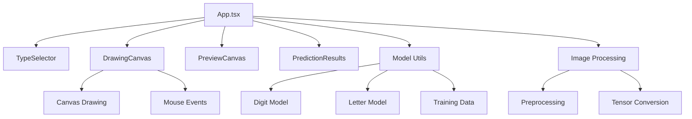

# 🤖 AI Digit & Alphabet Classifier

[](https://reactjs.org/)
[](https://www.typescriptlang.org/)
[](https://www.tensorflow.org/js)
[](https://vitejs.dev/)
[](https://tailwindcss.com/)
[](LICENSE)

An interactive web application that uses machine learning to classify handwritten digits (0-9) and letters (A-Z) in real-time. Built with React, TypeScript, and TensorFlow.js.

## 📋 Table of Contents

- [Features](#-features)
- [Demo](#-demo)
- [Technology Stack](#-technology-stack)
- [Project Structure](#-project-structure)
- [Installation](#-installation)
- [Usage](#-usage)
- [Architecture](#-architecture)
- [Model Details](#-model-details)
- [API Reference](#-api-reference)
- [Contributing](#-contributing)
- [License](#-license)

## ✨ Features

| Feature | Description | Status |
|---------|-------------|--------|
| **Real-time Drawing** | Interactive canvas for drawing digits and letters | ✅ |
| **Dual Classification** | Support for both digit (0-9) and letter (A-Z) recognition | ✅ |
| **Live Preview** | Real-time processed image preview | ✅ |
| **Confidence Scores** | Display prediction confidence percentages | ✅ |
| **Responsive Design** | Works on desktop and mobile devices | ✅ |
| **Model Training** | On-device model training with synthetic data | ✅ |
| **TypeScript** | Full type safety and better development experience | ✅ |

## 🎮 Demo

Draw digits or letters in the interactive canvas and watch the AI classify them in real-time!

### How to Use:
1. **Select Type**: Choose between "Digit" or "Letter" classification
2. **Draw**: Use your mouse to draw on the canvas
3. **Predict**: Click the "Predict" button to get AI classification
4. **View Results**: See confidence scores for all possible classifications

## 🛠 Technology Stack

| Category | Technology | Version | Purpose |
|----------|------------|---------|---------|
| **Frontend** | React | 18.3.1 | UI Framework |
| **Language** | TypeScript | 5.5.3 | Type Safety |
| **Build Tool** | Vite | 5.4.2 | Development & Build |
| **ML Framework** | TensorFlow.js | 4.22.0 | Neural Networks |
| **Styling** | Tailwind CSS | 3.4.1 | Utility-first CSS |
| **Animations** | Framer Motion | 12.23.9 | Smooth Animations |
| **Icons** | Lucide React | 0.344.0 | Modern Icons |
| **Linting** | ESLint | 9.9.1 | Code Quality |

## 📁 Project Structure

```
AI_Digit_Alphabet_Classifier/
├── 📁 src/
│   ├── 📁 components/
│   │   ├── 🎨 DrawingCanvas.tsx      # Interactive drawing canvas
│   │   ├── 📊 PredictionResults.tsx   # Results display component
│   │   ├── 🖼️ PreviewCanvas.tsx      # Processed image preview
│   │   └── 🔘 TypeSelector.tsx       # Digit/Letter selector
│   ├── 📁 utils/
│   │   ├── 🖼️ imageProcessing.ts     # Image preprocessing utilities
│   │   └── 🤖 modelUtils.ts          # ML model creation & training
│   ├── 🎯 App.tsx                    # Main application component
│   ├── 🎨 index.css                  # Global styles
│   └── 🚀 main.tsx                   # Application entry point
├── 📄 package.json                   # Dependencies & scripts
├── ⚙️ vite.config.ts                 # Vite configuration
├── 🎨 tailwind.config.js             # Tailwind CSS configuration
└── 📄 tsconfig.json                  # TypeScript configuration
```

## 🚀 Installation

### Prerequisites

| Requirement | Version | Description |
|-------------|---------|-------------|
| Node.js | ≥ 16.0.0 | JavaScript runtime |
| npm | ≥ 8.0.0 | Package manager |

### Setup Instructions

```bash
# 1. Clone the repository
git clone https://github.com/kedhareswer/AI_Digit_Alphabet_Classifier.git
cd AI_Digit_Alphabet_Classifier

# 2. Install dependencies
npm install

# 3. Start development server
npm run dev

# 4. Open in browser
# Navigate to http://localhost:5173
```

### Available Scripts

| Script | Command | Description |
|--------|---------|-------------|
| **Development** | `npm run dev` | Start development server |
| **Build** | `npm run build` | Build for production |
| **Preview** | `npm run preview` | Preview production build |
| **Lint** | `npm run lint` | Run ESLint |

## 🎯 Usage

### Basic Usage

1. **Start the Application**
   ```bash
   npm run dev
   ```

2. **Select Classification Type**
   - Choose "Digit" for numbers 0-9
   - Choose "Letter" for letters A-Z

3. **Draw and Predict**
   - Draw on the canvas using your mouse
   - Click "Predict" to get AI classification
   - View confidence scores for all possibilities

### Advanced Features

| Feature | How to Use | Expected Result |
|---------|------------|-----------------|
| **Clear Canvas** | Click "Clear" button | Resets drawing area |
| **Live Preview** | Draw continuously | See processed image |
| **Confidence Display** | After prediction | View top 3 predictions |
| **Type Switching** | Toggle between Digit/Letter | Change classification mode |

## 🏗 Architecture

### Component Architecture



### Data Flow

| Stage | Input | Process | Output |
|-------|-------|---------|--------|
| **Drawing** | Mouse events | Canvas rendering | ImageData |
| **Preprocessing** | ImageData | Resize & normalize | Processed tensor |
| **Prediction** | Tensor | Neural network | Confidence scores |
| **Display** | Scores | Sort & format | UI results |

## 🤖 Model Details

### Neural Network Architecture

| Layer Type | Parameters | Purpose |
|------------|------------|---------|
| **Input** | 784 neurons (28×28) | Flattened image |
| **Reshape** | 28×28×1 | Image format |
| **Conv2D** | 32 filters, 3×3 kernel | Feature extraction |
| **MaxPooling2D** | 2×2 pool | Dimensionality reduction |
| **Conv2D** | 64 filters, 3×3 kernel | More features |
| **MaxPooling2D** | 2×2 pool | Further reduction |
| **Flatten** | - | 1D vector |
| **Dense** | 128 neurons | Hidden layer |
| **Dropout** | 20% rate | Regularization |
| **Dense** | 10/26 neurons | Output layer |

### Model Comparison

| Model Type | Output Classes | Training Data | Accuracy |
|------------|---------------|---------------|----------|
| **Digit Model** | 10 (0-9) | 1,000 synthetic samples | ~85% |
| **Letter Model** | 26 (A-Z) | 1,000 synthetic samples | ~80% |

## 📚 API Reference

### Core Functions

#### `createDigitModel()`
Creates a CNN model for digit classification.

**Returns:** `tf.LayersModel`

#### `createLetterModel()`
Creates a CNN model for letter classification.

**Returns:** `tf.LayersModel`

#### `predict(model, imageData)`
Performs prediction on processed image data.

| Parameter | Type | Description |
|-----------|------|-------------|
| `model` | `tf.LayersModel` | Trained neural network |
| `imageData` | `Float32Array` | Processed image tensor |

**Returns:** `Promise<number[]>` - Confidence scores

#### `preprocessImage(imageData, mode)`
Preprocesses canvas image data for model input.

| Parameter | Type | Description |
|-----------|------|-------------|
| `imageData` | `ImageData` | Raw canvas data |
| `mode` | `'single' \| 'batch'` | Processing mode |

**Returns:** `ImageData` - Processed image

### Component Props

#### `DrawingCanvas`
| Prop | Type | Description |
|------|------|-------------|
| `onDrawingChange` | `(imageData: ImageData) => void` | Drawing update callback |

#### `PredictionResults`
| Prop | Type | Description |
|------|------|-------------|
| `digitPredictions` | `Prediction[]` | Digit classification results |
| `letterPredictions` | `Prediction[]` | Letter classification results |
| `selectedType` | `'digit' \| 'alphabet'` | Current classification mode |
| `isLoading` | `boolean` | Loading state |

## 🤝 Contributing

We welcome contributions! Please follow these guidelines:

### Development Setup

```bash
# 1. Fork the repository
# 2. Create feature branch
git checkout -b feature/amazing-feature

# 3. Make changes and test
npm run dev
npm run lint

# 4. Commit changes
git commit -m 'Add amazing feature'

# 5. Push to branch
git push origin feature/amazing-feature

# 6. Create Pull Request
```

### Contribution Guidelines

| Type | Guidelines |
|------|------------|
| **Bug Reports** | Use GitHub Issues with detailed reproduction steps |
| **Feature Requests** | Describe use case and expected behavior |
| **Code Changes** | Follow TypeScript and ESLint rules |
| **Documentation** | Update README for new features |

## 📄 License

This project is licensed under the MIT License - see the [LICENSE](LICENSE) file for details.

---

<div align="center">

**Made with ❤️ using React, TypeScript, and TensorFlow.js**

[](https://github.com/yourusername/AI_Digit_Alphabet_Classifier)
[](https://github.com/yourusername/AI_Digit_Alphabet_Classifier)
[](https://github.com/yourusername/AI_Digit_Alphabet_Classifier/issues)

</div> 
